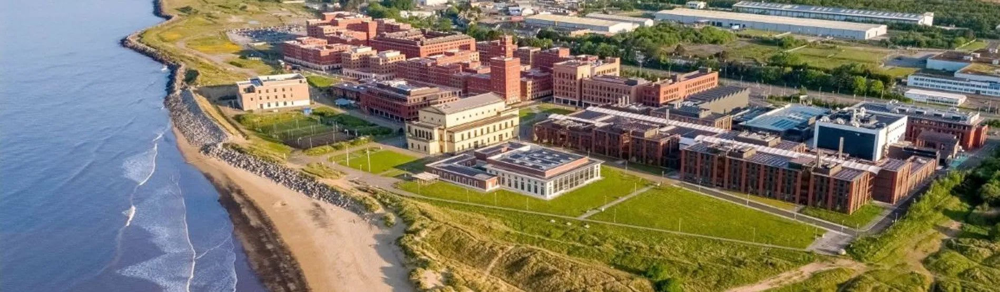

### **Swansea Seminar in Mathematics 2025/26**

<!--Research seminars and colloquia of the mathematics department at Swansea University-->

Our seminars are held on Thursdays either in person - in Robert Recorde Room CoFo 102 or online - via zoom, from 15:00 to 16:00

Please contact [Angelica Pachon](https://www.swansea.ac.uk/staff/a.y.pachon/) for more information.

## **Semester 2.** 

| Date | Speaker | Institution | Tittle | Room |
| --- | --- | --- | --- | --- |
| 29/01/26 | [Gabriela Jeronimo](https://mate.dm.uba.ar/~jeronimo/) | Universidad de Buenos Aires | [Algorithmic equidimensional decomposition of affine varieties defined by sparse polynomials](https://github.com/apachonpinzon/SwanSMath/blob/main/Abstracts.md)| CoFo 002 |
| 19/02/26 | [Panagiotis Spanos](https://sites.google.com/view/spanosp) | Ruhr-Universität Bochum |[Criticality in Spread-Out Percolation](https://github.com/apachonpinzon/SwanSMath/blob/main/Abstracts.md) | [Online](https://swanseauniversity.zoom.us/j/96125860350?pwd=1B1WwWWwllr9yqKnEZXTIc1bUUVIVs.1)|
| 05/03/26 | [Michael Hinz](https://www.math.uni-bielefeld.de/~mhinz/home.html) | Bielefeld Universität | | Online |
| 19/03/26 | [Bertrand Gauthier](https://profiles.cardiff.ac.uk/staff/gauthierb) | Cardiff Universty | | CoFo 102 |
| 30/04/26 | [Natasha Blivic](https://www.qmul.ac.uk/maths/profiles/blitvicn.html) | Queen Mary University of London | | CoFo 102|
| 14/05/26 | [Sabine Jansen](https://www.mathematik.uni-muenchen.de/~jansen/) | LMU München | | Online |

